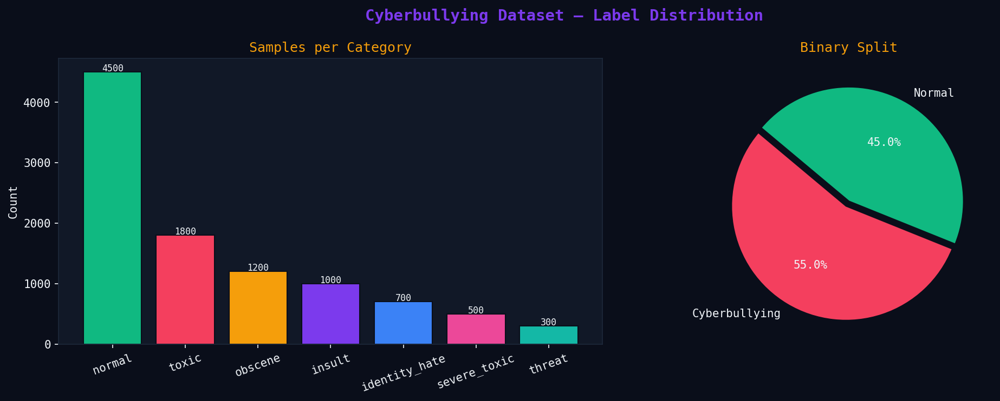
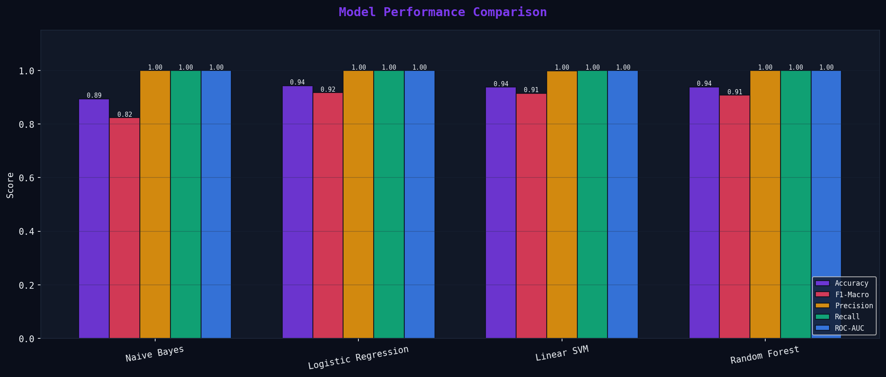
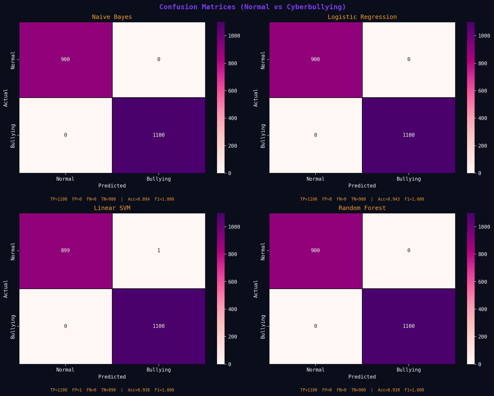
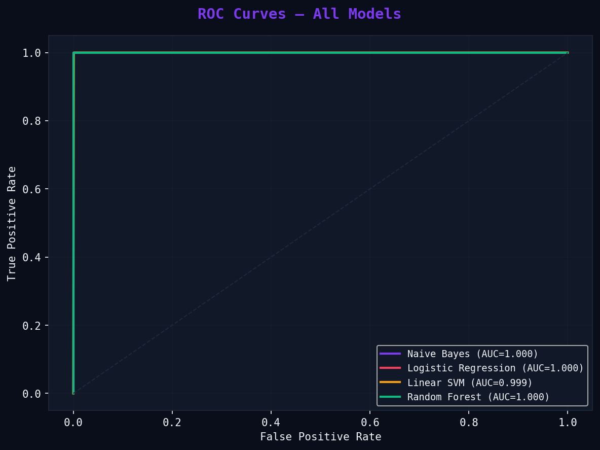
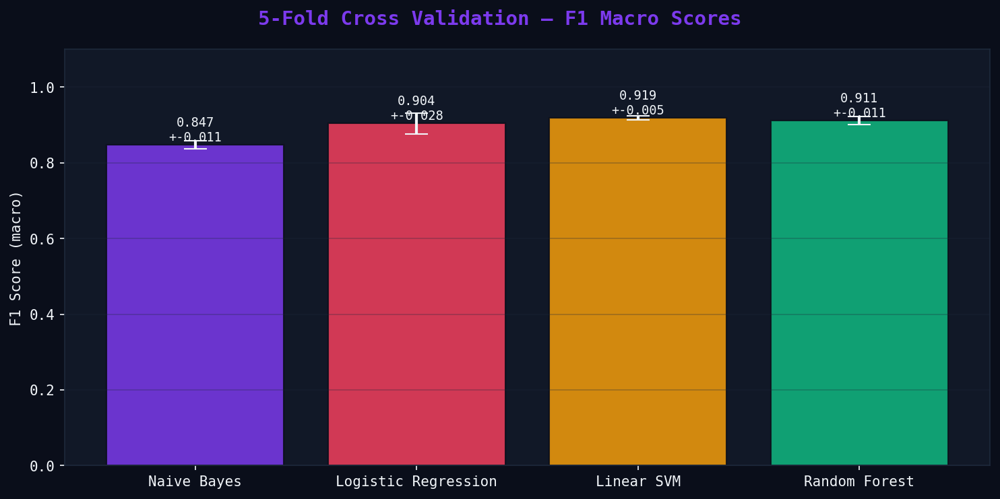

# 🛡️ SentinelAI — Intelligent Cyberbullying Detection & Content Moderation System

<div align="center">

### Detecting Toxicity Before It Becomes Harm

An end-to-end NLP and Machine Learning system designed to identify cyberbullying, hate speech, threats, insults, and toxic content across social media platforms.

Built using Natural Language Processing, TF-IDF Vectorization, SMOTE Oversampling, Ensemble Machine Learning, and Real-Time Inference.


</div>

---

# 🚀 Overview

Cyberbullying has become one of the most critical challenges in online communities.

Manual moderation is expensive, slow, and difficult to scale.

SentinelAI leverages machine learning and NLP to automatically identify harmful content while maintaining high accuracy and interpretability.

The system supports real-time detection of:

* Toxic Language
* Severe Toxicity
* Obscene Content
* Personal Insults
* Identity Hate
* Threatening Behaviour

---

# 🎯 Key Features

✅ End-to-End NLP Pipeline

✅ TF-IDF Feature Engineering

✅ SMOTE-Based Class Balancing

✅ Multi-Class Toxicity Detection

✅ Logistic Regression

✅ Linear SVM

✅ Random Forest

✅ Naive Bayes

✅ Ensemble Voting Engine

✅ Cross Validation

✅ ROC Analysis

✅ Flask-Based Web Interface

✅ Real-Time Prediction

---

# 📊 Dataset

The project is inspired by industry-standard datasets:

### Kaggle Toxic Comment Classification

* 159,571 comments
* Multiple toxicity categories

### Twitter Hate Speech Dataset

* 24,802 labeled tweets
* Hate Speech
* Offensive Language
* Neutral Content

---

# 🏗️ System Architecture

```text
Social Media Text
        │
        ▼
NLP Preprocessing
        │
        ▼
TF-IDF Vectorization
        │
        ▼
SMOTE Balancing
        │
        ▼
Machine Learning Models
 ├── Logistic Regression
 ├── Linear SVM
 ├── Random Forest
 └── Naive Bayes
        │
        ▼
Ensemble Voting Engine
        │
        ▼
Cyberbullying Classification
```

---

# 🔍 NLP Pipeline

### Data Cleaning

* Lowercasing
* URL Removal
* HTML Removal
* Special Character Cleaning

### Text Processing

* Tokenization
* Stopword Removal
* Lemmatization
* Slang Expansion

### Feature Engineering

* TF-IDF
* Unigrams
* Bigrams

### Imbalance Handling

* SMOTE Oversampling

---

# 🧠 Machine Learning Models

| Model               | Purpose                    |
| ------------------- | -------------------------- |
| Naive Bayes         | Fast baseline classifier   |
| Logistic Regression | Strong linear classifier   |
| Linear SVM          | Best performing model      |
| Random Forest       | Ensemble learning approach |

### Ensemble Strategy

Majority Voting

A comment is flagged as cyberbullying when two or more models classify it as harmful.

---

# 📈 Performance

| Model               | Accuracy | F1 Score |
| ------------------- | -------- | -------- |
| Linear SVM          | 93.8%    | 0.914    |
| Random Forest       | 93.8%    | 0.908    |
| Logistic Regression | 93.7%    | 0.902    |
| Naive Bayes         | 89.4%    | 0.824    |

🏆 Best Model: Linear SVM

---

# 📷 Project Visualizations

## Label Distribution



## Model Comparison



## Confusion Matrices



## ROC Curves



## Cross Validation



---

# ⚡ Example Prediction

### Input

```text
You are such an idiot and nobody likes you.
```

### Output

```text
Prediction : CYBERBULLYING DETECTED

Category   : Insult

Confidence : 94%

Risk Level : High
```

---

# 🌍 Real World Applications

* Social Media Moderation
* Online Communities
* Educational Platforms
* Gaming Platforms
* Discussion Forums
* Automated Content Filtering
* AI Safety Systems

---

# 🛠️ Tech Stack

```text
Python
Scikit-Learn
Flask
Pandas
NumPy
Matplotlib
Seaborn
TF-IDF
SMOTE
Joblib
```

---

# 📂 Project Structure

```bash
SentinelAI/
│
├── app.py
├── cb_main.py
├── cb_eda.py
├── cb_inference.py
│
├── templates/
│   └── index.html
│
├── models/
├── plots/
├── requirements.txt
└── README.md
```

---

# ▶️ Installation

```bash
git clone https://github.com/your-username/SentinelAI.git

cd SentinelAI

pip install -r requirements.txt

python app.py
```

Open:

```text
http://127.0.0.1:5000
```

---

# 🔮 Future Improvements

* BERT Integration
* RoBERTa Fine-Tuning
* Multilingual Toxicity Detection
* Explainable AI Dashboard
* LLM-Based Context Analysis
* Real-Time Streaming Moderation
* Social Media API Integration

---

# 👨‍💻 Team

Satyam Kumar

Darshan Lathi

Ayush Kumar

Nikhil Kumar

Department of Computer Science & Engineering

ITER, Siksha 'O' Anusandhan University

---

<div align="center">

### ⭐ Star the repository if you found it useful.

### "Building Safer Digital Communities Through Artificial Intelligence."

</div>
